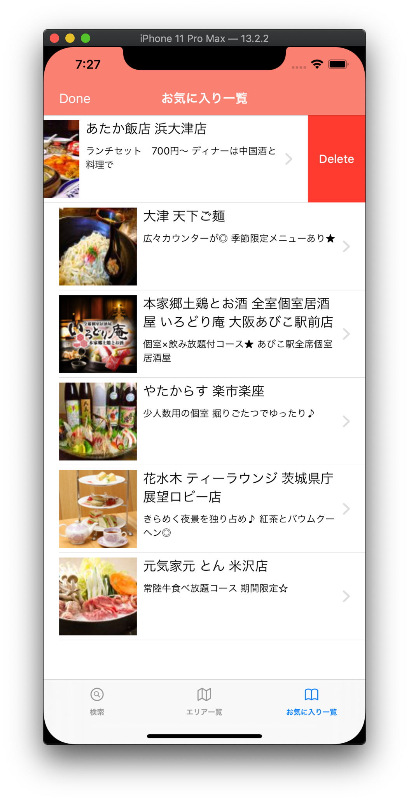

# SwiftUISamplePublic

ホットペッパーAPIを使ったサンプルプロジェクト

アーキテクチャー検証のためにシンプルな小さなアプリが欲しくて作成したプロジェクトです。

外部ライブラリを使わず、Appleが用意したものだけで実現しているのが特徴となります。

コードも特別難しい書き方をせずにシンプルに作成しています。

# 動作環境
- Xcode 11.3.1
- Developer Tagrget: iOS 13.2

# 動作させる際の注意点

ApiKey.swift ファイルを各自で入手したキーに差し替えて動作させてください。

# 画面

# LICENSE

MIT
